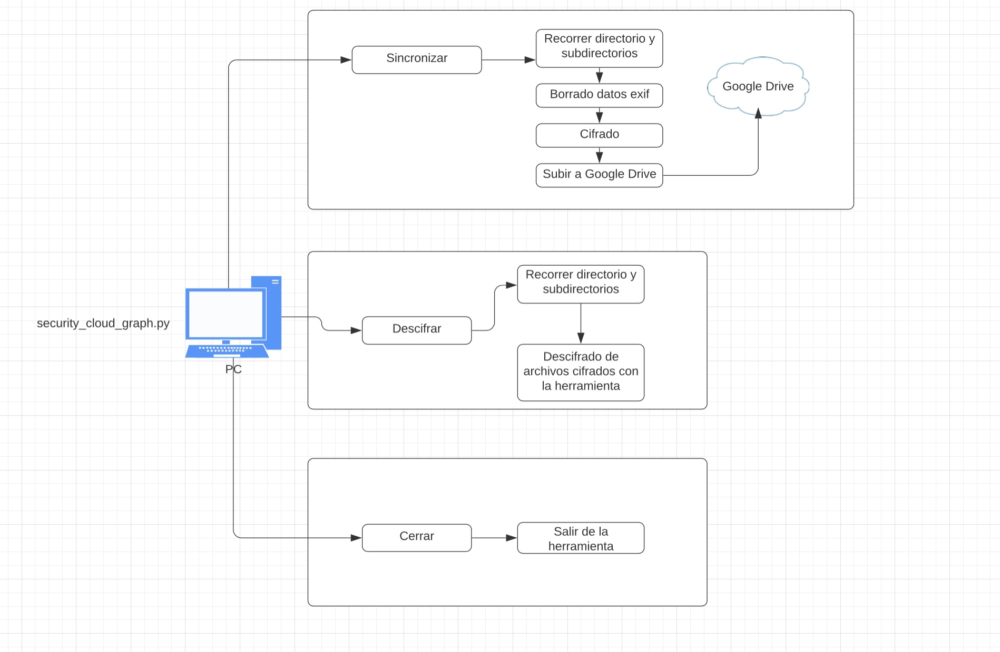

# Project title
Desarrollo de una herramienta de privacidad para sistemas de almacenamiento cloud.

## Project description

Este trabajo se ha dedicado a automatizar el proceso de añadir una capa extra de seguridad en entornos de sistemas de almacenamiento en la nube. Gracias a ello, al utilizar la herramienta desarrollada en este trabajo se previene en gran medida un acceso a datos no autorizados si se llega a romper o saltar la seguridad de algunos de estos sistemas. También ayuda a añadir una capa de privacidad al eliminar todos los datos exif de las fotos, que contienen datos tan sensibles cómo la ubicación donde se realizó, fecha, hora, dispositivo con el que se realizó la foto, etc.

## Features

Realiza un recorrido por el directorio que se le indique, en él irá borrando los datos EXIF de las imágenes, después cifrará todos los archivos que contengan la ruta, individualmente usando un cifrado AES y una función hash SHA256 de la contraseña introducida. Después se subiran todas las imagenes cifradas por separado a Google Drive.

Esta herramienta puede ser usada tanto en sistemas MacOS, Windows o Linux.

## How to run
Librerias necesarias:
> pip3 install -r requirements.txt

Vía terminal:
> python3 security_cloud.py 

Herramienta gráfica:
> python3 security_cloud_graph.py

## Architecture
Existen dos versiones, una versión gráfica y otra vía comandos desde la terminal. Ambas realizan las mismas funciones. El funcionamiento de la herramienta es el siguiente:
- Se selecciona la ruta en la que se encuentran los ficheros que se quieren subir a Google Drive. La selección funciona de manera recursiva, por lo que, si existen subcarpetas con ficheros, la aplicación también los sincronizará.

- Se elige la contraseña que se utilizará para cifrar o descifrar los ficheros de manera independiente.

- La herramienta da la opción de sincronizar o descifrar los ficheros que se encuentren en la ruta indicada anteriormente.

      - Si elige sincronizar:

           - Se recorre el directorio de manera recursiva, elimina los datos exif de todas las imágenes, se cifran todos los ficheros que contengan la ruta independientemente, usando un cifrado AES, y por último se suben los ficheros cifrados a Google Drive.

      - Si elige descifrar:

           - Se descifran todos los ficheros que se encuentren en la ruta indicada de forma recursiva y que se hayan cifrado anteriormente con la herramienta.

## Prepare development/execution environment
La API de Google Drive requiere OAuth2.0 para la autenticación, se utiliza para paliar la necesidad que se establece del envío continuo de credenciales entre cliente y servidor. Si la aplicación cliente es nuestra y la API REST también, posiblemente no existan grandes dificultades. El problema está cuando se quiere hacer una integración con aplicaciones de terceros, ahí es donde aparece la dificultad. Con OAuth2 el usuario delega la capacidad de realizar ciertas acciones, no todas, a las cuales da su consentimiento para hacerlas en su nombre.

Para poder llevar la autenticación con google drive, es necesario que anteriormente se realice una configuración en la cuenta donde se quiere subir los ficheros de la herramienta.

Lo primero es ir a la consola de desarrolladores de Google con la cuenta que se quiera utilizar de Google Drive. 

1.	Crear un nuevo proyecto.

2.	Buscar "Google Drive API", seleccionar y click en "Habilitar API".

3.	Seleccionar "Credenciales" en el menú de la izquierda y click en "Crear credenciales", seleccionar "ID de cliente OAuth".

4.	Después se debe configurar el nombre del producto y la pantalla de consentimiento -> en "Configurar pantalla de consentimiento" y seguir las indicaciones. Una vez terminado:

       4.1.	Seleccionar "Tipo de aplicación" para que sea una aplicación web.
  
       4.2.	Asignar un nombre.
  
       4.3.	Introducir http://localhost:8080 para "Orígenes autorizados de JavaScript".
  
       4.4.	Ingrese http://localhost:8080/ para "URI de redireccionamiento autorizado".
  
       4.5.	Clic en Guardar'.

5.	Seleccionar "Descargar JSON" en el lado derecho del ID de cliente para descargar client_secret_ <ID largo> .json.

6.	El archivo descargado tiene toda la información de autenticación de la cuenta. Es necesario cambiar el nombre del archivo a "client_secrets.json" y colocar en el mismo directorio que la herramienta.

